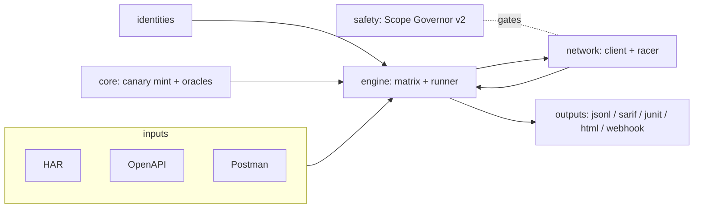

<h1 align="center">AuthDiff v2</h1>

<p align="center">
  <b>Differential Authorization Testing Framework</b><br>
  Deterministic, canary-oracle detection of broken access control —
  BOLA/IDOR, BFLA, mass-assignment, and single-use race conditions.
</p>

<p align="center">
  
  
  
  
</p>

> ⚠️ **Authorized use only.** AuthDiff is a discovery / proof-of-concept tool for
> systems you own or are explicitly permitted to test. Every network command
> requires `--authorized`, writes are blocked unless `--allow-writes` is set, and
> a scope governor gates all egress.

---

## Why AuthDiff

Scanners see one request at a time, so they are blind to **authorization** — a
*relation* between an identity, an object, and a capability. When user A requests
`/orders/8213` and gets `200 OK`, the response looks identical whether or not the
order belongs to A. AuthDiff injects **ground truth**: it plants self-authenticating
**canary tokens** (HMAC-bound to their owner) into each identity's private data,
then replays traffic across identities. A foreign canary in another identity's
response is an **unforgeable cryptographic proof** of a leak. Detection becomes an
equality check → **0% false positives by construction**.

## Features

| Area | Highlights |
|------|-----------|
| **Deterministic oracles** | BOLA/IDOR, mass-assignment (proven via canary); BFLA (heuristic); race limit-bypass (numeric invariant). Content-hash invariant catches non-echoed leaks. |
| **Canary system** | Self-authenticating tokens, multi-type (text/email/JSON/number/UUID), **key rotation** via a key-ring, registry-backed numeric/UUID canaries. |
| **Differential engine** | Cross-identity replay matrix (+ anonymous), de-duplication, baseline diffing, async fan-out. |
| **Pluggable** | Add custom oracles via `OracleRegistry` or an `authdiff.oracles` entry point — no core changes. |
| **Inputs** | HAR (streaming via `ijson`), OpenAPI 3.x (+ seed-candidate discovery), Postman v2.1, auto-detection. |
| **Outputs** | JSON-lines (SIEM), **SARIF** (GitHub Code Scanning), **JUnit XML** (GitLab/Jenkins), standalone **HTML**, Slack/Discord/Teams webhooks. |
| **Safety (Scope Governor v2)** | Host-glob + IP/CIDR allowlist, DNS pinning (anti-rebinding), token-bucket rate limit, concurrency cap, 429 back-off, non-destructive default, file/env **kill-switch**. |
| **Racer** | HTTP/2 single-packet attack (jitter-free) with warm-up. |
| **CI/CD** | Typer CLI with exit codes, Docker image, GitHub Actions, SARIF upload example. |

## Architecture



## Install

```bash
pip install authdiff                # from PyPI (once published)
pip install ".[fast]"               # from source, with streaming HAR support
# extras: .[http3]  .[web]  .[dev]
```

## Quickstart

```bash
authdiff selftest                                   # prove the oracle offline
cp authdiff.config.example.yaml config.yaml         # then edit identities/scope
export ALICE_TOKEN=... BOB_TOKEN=...
authdiff run --config config.yaml --authorized \
    --input alice=alice.har --sarif out.sarif --html report.html
```

Exit codes: `0` none · `1` findings · `2` config error · `3` scope/safety violation.

### Quickstart (بالعربي)

```bash
authdiff selftest                       # إثبات الأوراكل أوفلاين
cp authdiff.config.example.yaml config.yaml   # عدّل الهويات والنطاق
export ALICE_TOKEN=... BOB_TOKEN=...
authdiff run --config config.yaml --authorized --input alice=alice.har --html report.html
```
- محتاج **هويتين على الأقل** (owners/tenants مختلفة).
- الكتابة (POST/PUT/PATCH/DELETE) متوقفة افتراضيًا؛ فعّلها بـ `--allow-writes`.
- التوكنات بتتقري من متغيرات البيئة عبر `${VAR}` — متكتبهاش في ملف الإعداد.

## Configuration

See [`authdiff.config.example.yaml`](authdiff.config.example.yaml) and
[`docs/configuration.md`](docs/configuration.md) for the full reference (scope,
identities, observed traffic, seed, race).

## Roadmap (not yet shipped)

HTTP/3 (aioquic) · WebSocket & GraphQL transports · distributed workers (Redis) ·
FastAPI web dashboard · AI-assisted request tagging · Burp Suite extension.
These live as clearly marked stubs so the core stays lean and fully tested.

## Docs & test lab

```bash
docker compose up            # launches an intentionally vulnerable Flask lab
authdiff run --config testlab/lab.config.yaml --authorized
```

## Contributing / Security / License

See [CONTRIBUTING.md](CONTRIBUTING.md), [SECURITY.md](SECURITY.md), and
[LICENSE](LICENSE) (MIT). Discovery / PoC only — ships no weaponized exploits.
